<div align="center">

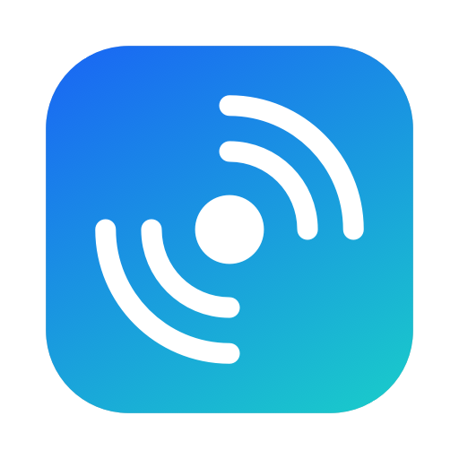

# squick-share

### Quick Share for your Mac. AirDrop-style sharing with Android, finally.

Send photos, videos, files, folders and links between your **Mac** and **Android phones** with the **Quick Share** button that's already on every Android device.
No cable. No cloud. No account. Straight over your Wi-Fi.


**[⬇︎ Download](../../releases/latest)** &nbsp;·&nbsp; **[📖 Documentation](https://mukesh-devs.github.io/squick-share/)** &nbsp;·&nbsp; **[How it works](#how-it-works)**

<br>

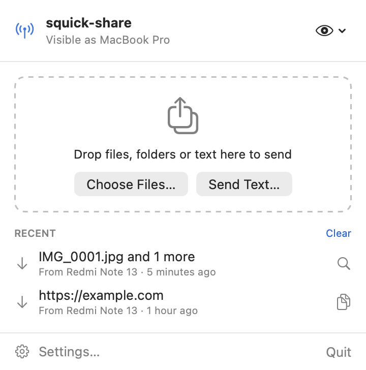&nbsp;&nbsp;
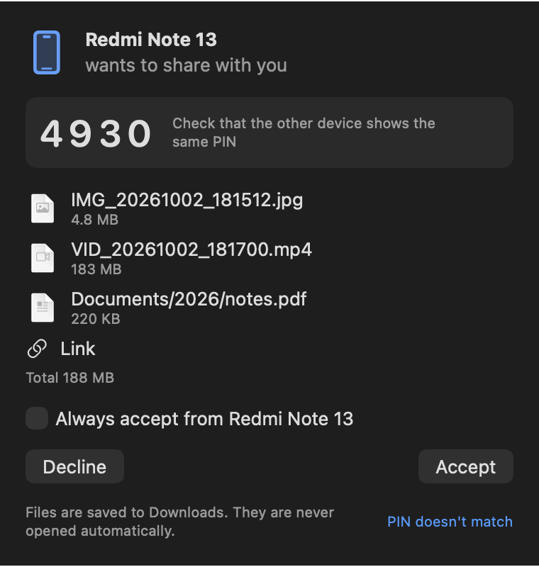&nbsp;&nbsp;
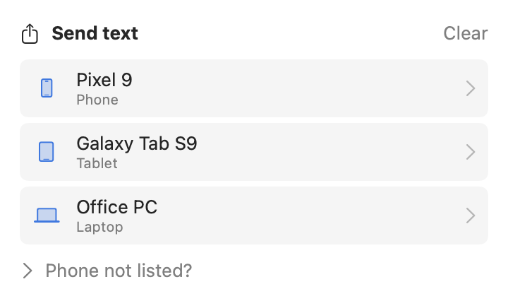

</div>

---

## Why squick-share?

Android has Quick Share. iPhone has AirDrop. Your Mac has… nothing that talks to Android. Until now.

- 📱 **Works with the phone you already have.** Nothing to install on Android. Just tap **Share › Quick Share** and pick your Mac.
- ⚡ **Fast.** Limited only by your Wi-Fi: about **35–40 MB/s** on a 5 GHz network. A 1 GB video arrives in about 30 seconds.
- 🔒 **Private and encrypted.** Files go directly from device to device, encrypted end to end. Nothing is uploaded anywhere, and there's no account.
- 🍏 **A real Mac app.** Native Swift and SwiftUI, a tiny menu bar footprint, light and dark mode, VoiceOver labels, Apple Silicon and Intel.

## Features

| | |
|---|---|
| 📥 **Receive from Android** | Accept or decline with a prompt and a notification showing who's sending, what, how big, and a **4-digit PIN** to confirm it's really them. |
| 📤 **Send to Android** | Drag files, folders or text onto the menu bar window, use **Choose Files…**, or right-click in Finder › **Share › squick-share**. |
| 📁 **Folders and many files** | Send whole folders (structure preserved) or dozens of files in one go. |
| 🔗 **Links and text** | Shared links open in a window with **Open Link** and **Copy**. Nothing opens by itself. |
| 📊 **Live progress** | Speed, time left and cancel for every transfer, plus a **progress ring in the menu bar** so you can follow it without opening anything. |
| 👀 **Visibility control** | Visible to everyone, hidden, or visible for 10 minutes with a countdown. |
| ✅ **Trusted devices** | Optionally auto-accept from your own phone after you approve it once. |
| 🗂 **Recent transfers** | One click to **Show in Finder**. Duplicate names never overwrite anything. |
| 🩺 **Built-in diagnostics** | One-click **Copy Diagnostic Log** that never contains file contents, file names or keys. |
| ⚙️ **Mac niceties** | Launch at login, choose your download folder, limit to Wi-Fi or Ethernet, notifications on/off. |

## Install in 2 steps

Download one DMG from the [**latest release**](../../releases/latest).

| File | For |
|---|---|
| `squick-share-<version>-universal.dmg` | **Any Mac.** Pick this if you're not sure. |
| `squick-share-<version>-arm64.dmg` | Apple Silicon Macs (M1, M2, M3, M4 …). Smaller download. |
| `squick-share-<version>-x86_64.dmg` | Intel Macs. Smaller download. |

Not sure which Mac you have? Apple menu › **About This Mac**: "Chip: Apple M…" is Apple Silicon, "Processor: … Intel" is Intel. Each release also includes a `.zip` of the same app.

### 1. Copy the app to Applications

Double-click the `.dmg`, then drag **squick-share** onto the **Applications** folder in the window that opens.

### 2. Allow it to open (first launch only)

squick-share is free and ad-hoc signed rather than notarized by Apple, so macOS asks you to confirm it once. Pick one:

- **A. System Settings:** open squick-share and click **Done** on the warning. Go to **System Settings › Privacy & Security**, scroll down, click **Open Anyway** and confirm. Open the app again and click **Open**. (On macOS 13 and 14: right-click the app › **Open** › **Open**.)
- **B. Terminal:** run one command:
  ```sh
  xattr -dr com.apple.quarantine /Applications/squick-share.app && open /Applications/squick-share.app
  ```

> **On first launch** an antenna icon appears in the menu bar (there's no Dock icon). When macOS asks to **find devices on your local network**, click **Allow**. This is required. Allow notifications too, for Accept/Decline alerts.

## Screenshots

<table>
<tr>
<td align="center">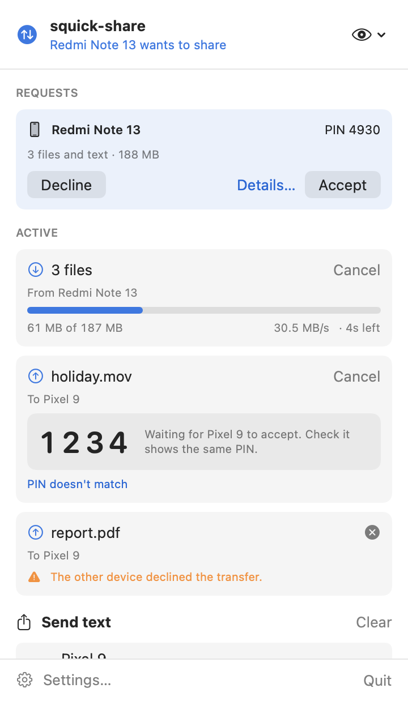<br><sub>Requests, live transfers and PIN check</sub></td>
<td align="center">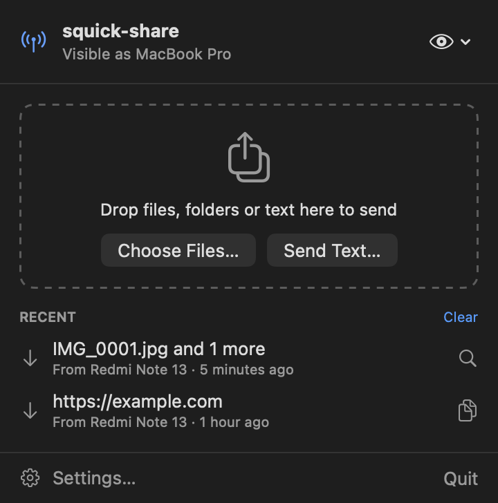<br><sub>Dark mode, ready to share</sub></td>
<td align="center">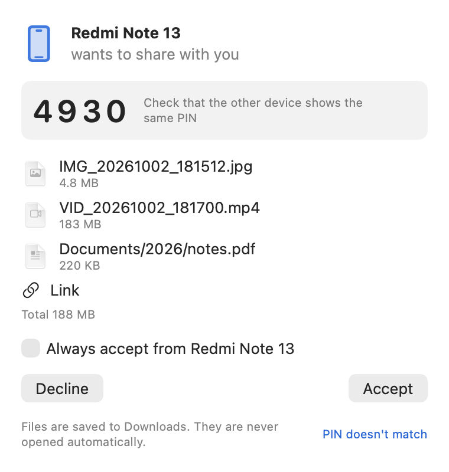<br><sub>Accept or decline, with file types and sizes</sub></td>
</tr>
<tr>
<td align="center">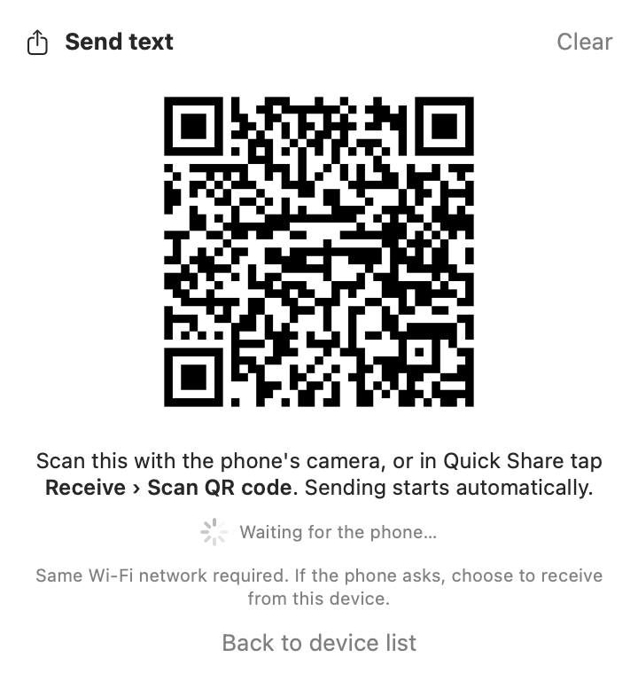<br><sub>Send panel</sub></td>
<td align="center">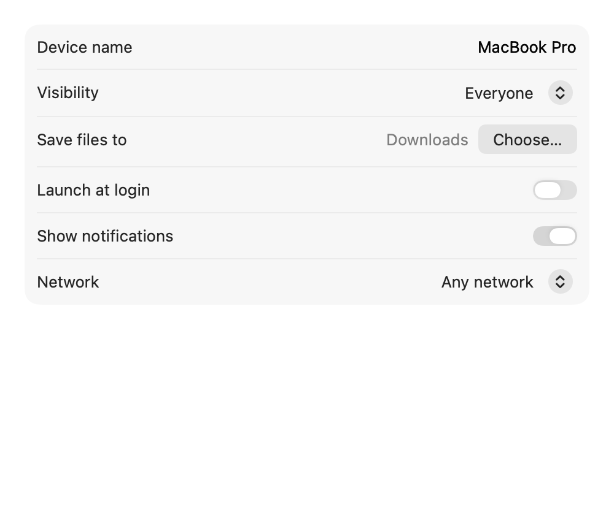<br><sub>Settings</sub></td>
<td align="center">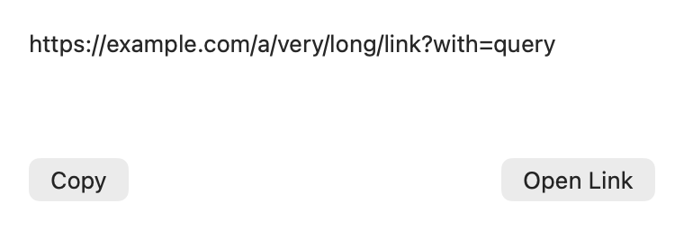<br><sub>Received links: Open or Copy</sub></td>
</tr>
</table>

**The menu bar icon tells you what's happening at a glance:**

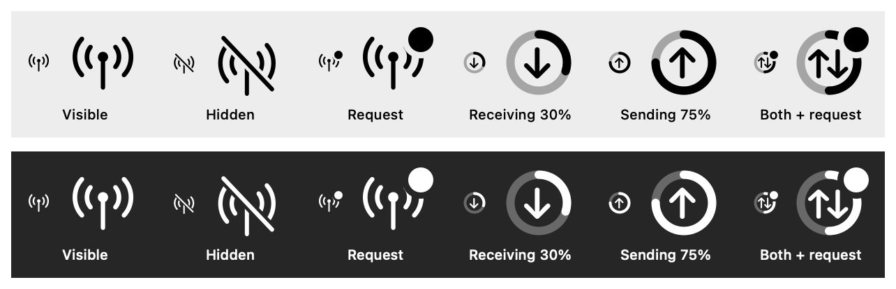

More screenshots and a full tour: **[documentation site](https://mukesh-devs.github.io/squick-share/)**.

---

## How to use it

**Phone → Mac**
1. On the phone, share anything and choose **Quick Share**.
2. Tap your Mac's name.
3. Check the **4-digit PIN** matches, then click **Accept**. Files land in **Downloads** and are never opened automatically.

**Mac → Phone**
1. Drop files, folders or text onto the squick-share window, or right-click in Finder › **Share › squick-share**.
2. On the phone, open **Files › Quick Share › Receive** (or the **Quick Share** tile in Quick Settings) and keep it open. Android phones only show up while this screen is open.
3. Click the phone when it appears, check the PIN, and accept on the phone.

> 💡 On Xiaomi/Redmi phones, use **Quick Share** (Google's), not "Xiaomi Share". If the phone doesn't see your Mac, choose **Announce Again** from the eye menu, and make sure both are on the same Wi-Fi (not a guest network).
> To use the Finder/Safari share menu, enable **squick-share** in System Settings › General › Login Items & Extensions › **Sharing** (macOS 15+), or Privacy & Security › Extensions › Sharing (macOS 13–14).

More help: [troubleshooting guide](docs/TESTING.md#if-the-mac-does-not-appear-on-the-phone).

---

## Tested and measured

| | |
|---|---|
| **Real device** | Android phone with Google Quick Share, both directions, PIN verified |
| **Speed** | ~35 MB/s phone → Mac, ~30 MB/s Mac → phone (5 GHz Wi-Fi) |
| **Big files** | 1.05 GB video in 30 s; an 11-file, 440 MB batch in 14 s |
| **Memory** | Streams to disk: a 128 MiB transfer adds about 1 MiB of memory |
| **Automated tests** | 77, including crypto checked against an independent Python implementation, malformed-data fuzzing, and loopback transfers |

## How it works

squick-share is a from-scratch Swift implementation of Google's Quick Share protocol over Wi-Fi.

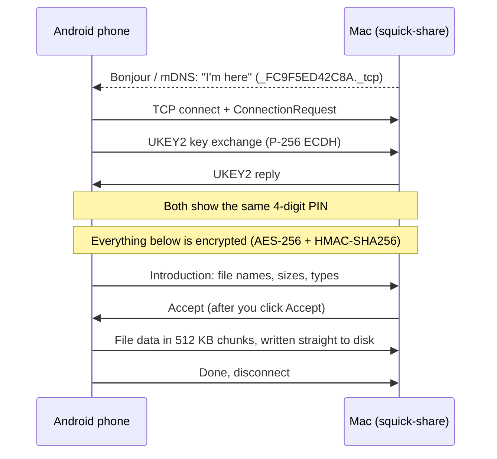

| Layer | What it does |
|---|---|
| **Discovery** | Advertises the Mac with Bonjour (mDNS) and finds phones the same way |
| **Handshake** | UKEY2: P-256 elliptic-curve Diffie-Hellman with a commitment, giving shared keys and the PIN |
| **Secure channel** | Every message is AES-256-CBC encrypted and HMAC-SHA256 signed, with strict sequence numbers |
| **Transfer** | Files stream in 512 KB chunks to a temporary file, then move into place atomically |

Every protocol constant is traced to Google's open-source code in [docs/PROTOCOL_NOTES.md](docs/PROTOCOL_NOTES.md).

## Privacy and security

- 🔐 **End-to-end encrypted.** Keys are created fresh for every transfer. The PIN lets you confirm the other device.
- 🏠 **Local only.** No servers, no accounts, no analytics. squick-share only talks to devices on your network.
- 🧹 **Safe file handling.** Incoming file names are sanitized (no `../` tricks, hidden files or spoofed extensions), files are written only inside your chosen folder, and they are never opened automatically.
- 🧱 **Sandboxed.** Runs in the macOS App Sandbox with the Hardened Runtime.

## Compatibility

| Peer | Status |
|---|---|
| Android with Google Quick Share | ✅ Tested, both directions |
| Pixel / Samsung | Expected to work (same protocol), not yet tested |
| Quick Share for Windows, RQuickShare (Linux) | Expected to work, not yet tested |

**Not supported:** Wi-Fi Direct and hotspot transfers (not available to normal Mac apps), internet relay, Google-account "Your devices / Contacts" visibility (use **Everyone**), Bluetooth.
**Not working yet:** QR-code pairing.
Both devices must be on the same Wi-Fi network.

---

## For developers

### Build from source

Requires Xcode 16 or later (tested with Xcode 26).

```sh
git clone <this repo> squick-share && cd squick-share
./scripts/build-release.sh --install   # universal Release build, ad-hoc signed, installed to /Applications
./scripts/build-release.sh --all       # universal, arm64 and x86_64 apps + squick-share-<version>-<arch>.zip
./scripts/make-dmg.sh                  # squick-share-<version>-<arch>.dmg for every variant built
```

`build-release.sh` builds `universal` by default. Use `--arch arm64`, `--arch x86_64` or `--all` for the others.
Everything goes into `build/release/`: one folder per variant with `squick-share.app`, plus the `.zip` and `.dmg` files.

| Signing | Command | Runs on |
|---|---|---|
| Ad-hoc (default) | `./scripts/build-release.sh` | The Mac that built it; other Macs need [step 2 of Install](#2-allow-it-to-open-first-launch-only). |
| Free Apple ID ("Personal Team") | `TEAM_ID=XXXXXXXXXX ./scripts/build-release.sh` | Your Macs. The team ID is in Xcode › Settings › Accounts. |
| Developer ID + notarization | `TEAM_ID=… SIGN_IDENTITY="Developer ID Application" NOTARY_PROFILE=notary ./scripts/build-release.sh` | Any Mac, no warnings. Needs the paid Apple Developer Program. |

Bundle ID: `tech.mukesh.squick-share` (set in `project.yml`).

### Releases and documentation (GitHub Actions + Pages)

- **Releases:** bump `MARKETING_VERSION` in `project.yml`, run `xcodegen generate`, commit, then `git tag v1.0.1 && git push origin v1.0.1`. The [release workflow](.github/workflows/release.yml) runs the tests and attaches `squick-share-<version>-{universal,arm64,x86_64}.{dmg,zip}` to a GitHub Release, with a link to the documentation site.
- **Documentation site:** [`docs/index.html`](docs/index.html), served by GitHub Pages (Settings › Pages › Deploy from a branch › `main`, folder `/docs`).
- **Screenshots:** `./scripts/make-screenshots.sh` re-renders every image in `docs/images/` from the real UI with neutral sample data.

### Project layout

```
SquickShare.xcodeproj         generated from project.yml (XcodeGen); committed
SquickShare/                  app: SwiftUI menu bar UI, settings, notifications
ShareExtension/               Finder / Safari share extension
Packages/QuickShareCore/      protocol, crypto, networking; no UI (Swift 6 language mode)
  proto/                      Google's Apache-2.0 .proto files, unmodified (see SOURCES.md)
  Sources/QuickShareCore/     Crypto/, Transport/, Discovery/, Transfer/, Protos/ (generated)
  Sources/SquickShareCLI/     squick-share-cli: receive / send / browse from Terminal
  Tests/QuickShareCoreTests/  unit, loopback, fuzz and mDNS integration tests
docs/                         documentation site (index.html, images/), PROTOCOL_NOTES, COMPATIBILITY, TESTING
scripts/                      build-release, make-dmg, make-screenshots, generate-protos, gen-test-vectors.py, make-icon
.github/workflows/            release.yml (builds the DMGs and zips)
```

The public API of `QuickShareCore` is small (`QuickShareReceiver`, `QuickShareSender`, `NearbyBrowser`, `QRCodeSession`, plus value types), so it could be replaced with another core later.

### Development commands

```sh
cd Packages/QuickShareCore && swift test           # 77 tests, about 25 s
swift run squick-share-cli receive --verbose        # receive in Terminal
xcodegen generate                                   # after editing project.yml (brew install xcodegen)
./scripts/generate-protos.sh                        # after changing .proto files (brew install protobuf swift-protobuf)
python3 scripts/gen-test-vectors.py                 # regenerate independent crypto vectors (pip install cryptography)
```

Debug builds understand `squickshare://debug-snapshot` and `squickshare://debug-send?to=NAME`, and render UI snapshots with `SQUICKSHARE_SNAPSHOT=1`. Release builds don't include these hooks.

## Credits and license

- squick-share is licensed under the [MIT License](LICENSE). The vendored Google protos and SwiftProtobuf stay under Apache-2.0; see [NOTICE](NOTICE).
- Protocol definitions: Google's [nearby](https://github.com/google/nearby) and [ukey2](https://github.com/google/ukey2) repositories (Apache-2.0), vendored unmodified in `Packages/QuickShareCore/proto/`.

<div align="center"><sub>Made for everyone with a Mac and an Android phone. ⭐ Star the repo if it saved you a cable.</sub></div>
